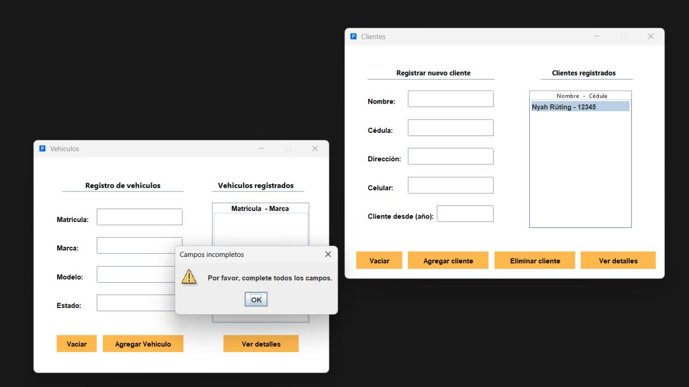
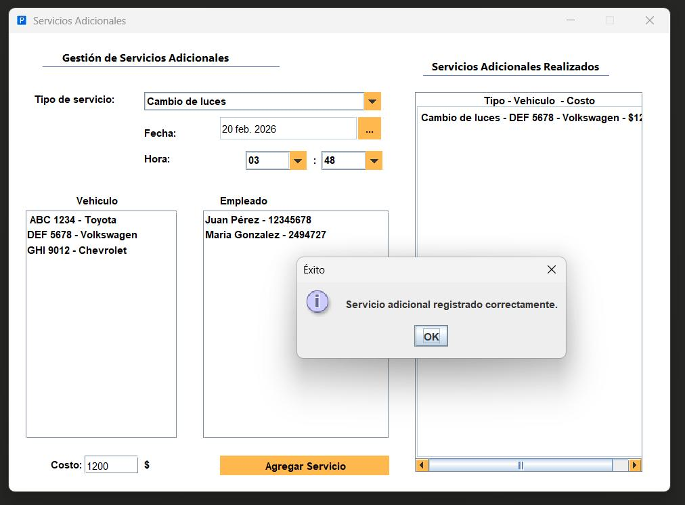
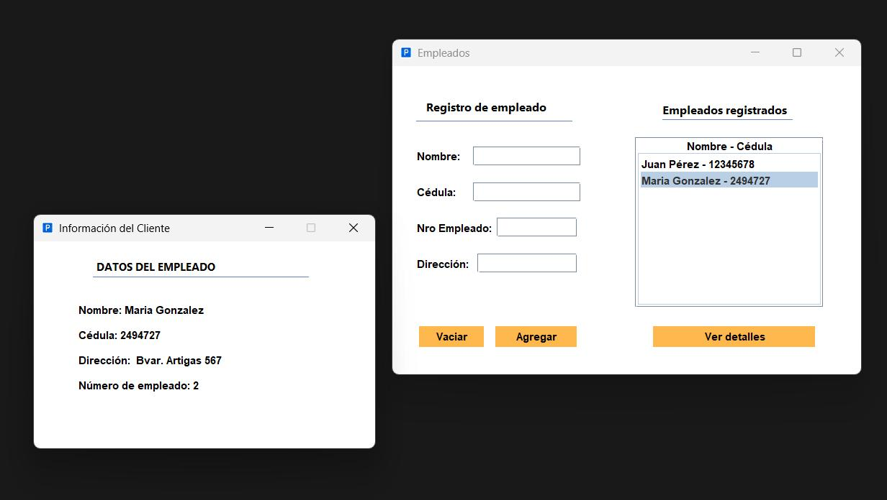
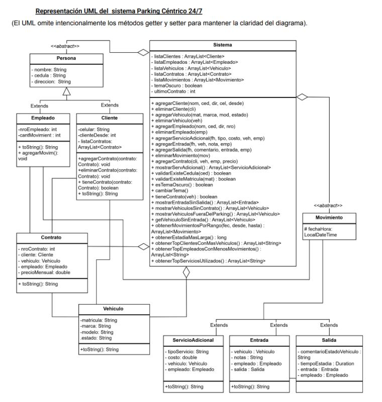

# Parking Céntrico 24/7

A full-featured desktop parking management system built in Java. Handles the complete operation of a parking lot: clients, employees, vehicles, entries/exits, monthly contracts, and additional services — with a reports module and persistent data storage.

> Built as a group project for **Programming 2** — ORT Uruguay. Demonstrates MVC architecture, OOP design with inheritance and polymorphism, and file-based persistence via Java serialization.

---

## Screenshots

| Client & Vehicle Management | Additional Services |
|---|---|
|  |  |

| Employee Management | UML Class Diagram |
|---|---|
|  |  |

---

## Features

- **Client management** — register, edit, and delete clients with ID (cédula) validation
- **Employee management** — register employees, track movement count per employee
- **Vehicle management** — register vehicles with plate, brand, model, and status tracking
- **Entries & exits** — record vehicle entries with timestamp, notes, and assigned employee; close exits with duration calculation and vehicle condition comments
- **Monthly contracts** — link contracts to clients and vehicles with a monthly price
- **Additional services** — register car wash, tire change, interior cleaning, and light replacement per vehicle, with cost tracking
- **Reports module** — movement history by date range, top clients by vehicle count, employees with least activity, longest stays
- **Dark / light theme** — toggle between themes, persisted across sessions
- **Data persistence** — full state saved via Java object serialization (no external database required)

---

## Architecture

The project follows **MVC (Model-View-Controller)**:

```
src/
├── modelo/          # Domain classes: Cliente, Empleado, Vehiculo, Contrato,
│                    #   Movimiento, Entrada, Salida, ServicioAdicional, Sistema
├── vista/           # Swing UI panels for each module
└── controlador/     # Event handling and business logic bridges
```

**Key OOP decisions:**
- `Persona` is an abstract base class extended by `Cliente` and `Empleado`
- `Movimiento` is an abstract class extended by `Entrada` and `Salida`
- `Sistema` acts as the central model holding all entity lists and exposing the full business logic API
- All state is serialized to disk — no database, no external dependencies beyond `JDatePicker`

See the full UML class diagram in `screenshots/uml.png`.

---

## Tech Stack

| | |
|---|---|
| Language | Java 24 |
| UI | Swing |
| Persistence | Java Serialization |
| Date picker | JDatePicker |
| Build | Apache Ant (`build.xml`) |

---

## How to Run

**Requirements:** Java 24 or higher

Download `ParkingCentrico24_7_FAT.jar` from [Releases](../../releases) and run:

```bash
java -jar ParkingCentrico24_7_FAT.jar
```

No installation needed. Data is saved automatically to a local file on exit.

---

## Authors

- **Nyah Rüting** — [github.com/nyah-R](https://github.com/nyah-R)
- **Facundo Esquivel**

ORT Uruguay — Electronic Engineering / Systems Engineering
